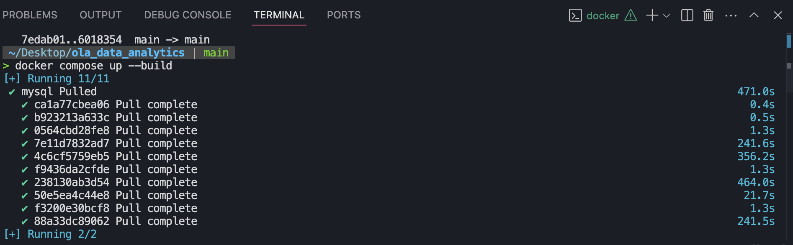
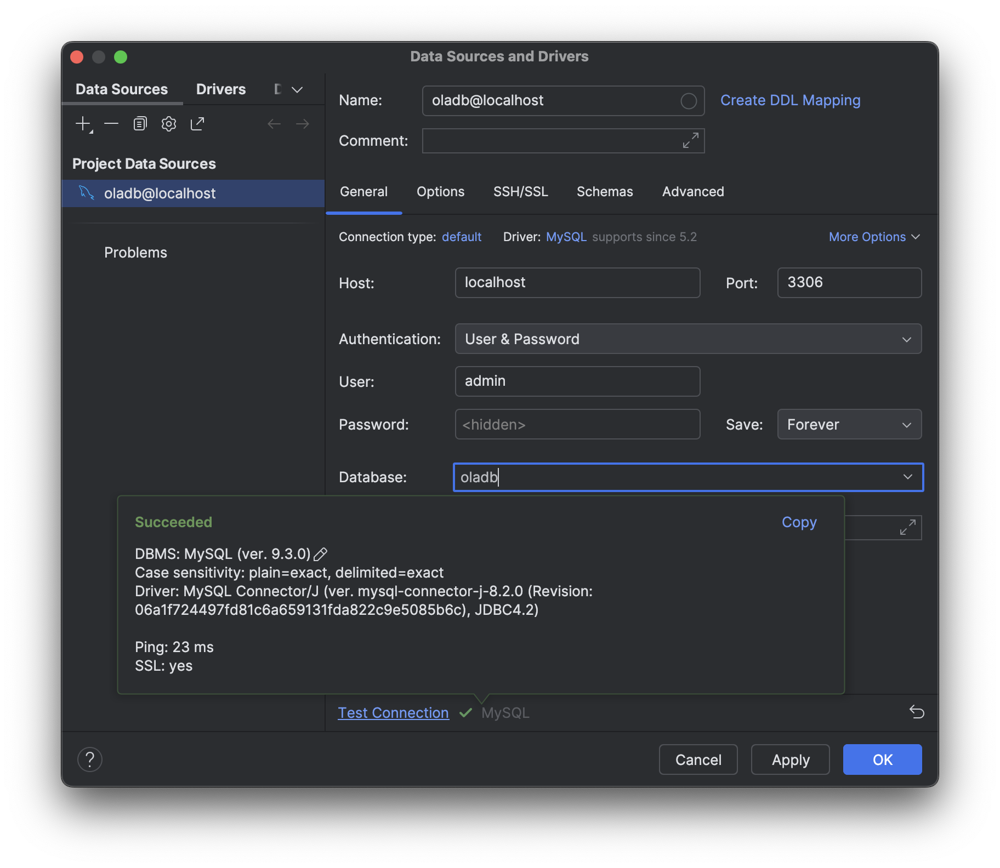
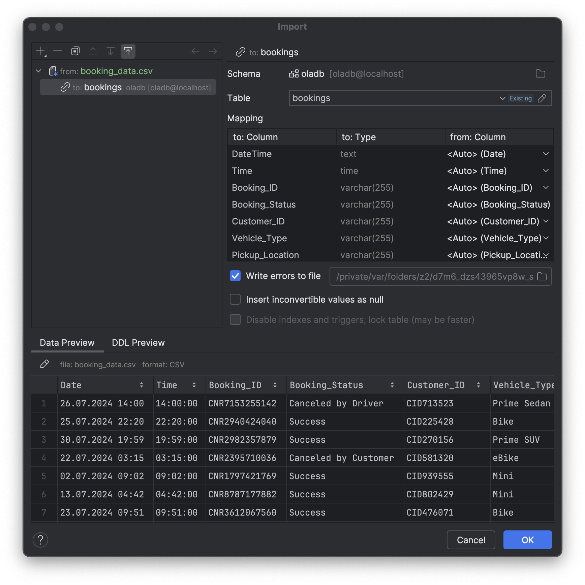

# 📊 OLA Ride Analysis Dashboard

[English](#english) | [Türkçe](#türkçe)

---

# English

## 📋 About The Project
Welcome to my OLA Ride Analysis Dashboard! This project dives deep into the world of ride-sharing data, uncovering fascinating patterns in how people use OLA's services. I built this analysis tool to help understand customer behavior, optimize ride operations, and improve service quality.

Through hands-on experience with real-world ride-sharing data, I've created a series of insightful analytics that reveal distances, customer ratings, and payment methods to derive meaningful insights from the data.

## 🚀 What's Inside
Ever wondered what makes a ride-sharing service tick? Here's what you'll discover:

✨ Booking Insights: Uncover patterns in successful rides and learn why some get cancelled
🚗 Vehicle Performance: See which car types are winning customers' hearts
⭐ Rating Stories: Dive into what makes both drivers and riders happy
💳 Payment Trends: Explore how people prefer to pay for their rides
📍 Journey Patterns: Discover popular routes and travel distances
💰 Value Analysis: Understand the economics behind each ride

## 🛠️ Technologies Used
- SQL/MySQL
- Docker
- Docker Compose
- DataGrip (IDE for Database Management)
- CSV data processing

### Why DataGrip? 🚀
I chose JetBrains DataGrip as our database IDE because it offers:
- Powerful SQL editor with smart code completion
- Visual query planning and execution
- Easy database navigation and schema visualization
- Excellent integration with Docker databases
- Support for multiple database types

## ⚙️ Installation and Setup

### Prerequisites
- Docker and Docker Compose installed on your system
- Git (optional)

### Installation Steps

1. Clone or download the repository:
```bash
git clone https://github.com/veliulugut/ola_data_analytics.git

cd ola_data_analytics
```

2. Start the Docker containers:
```bash
docker-compose up -d
```

3. The database will be automatically initialized with the schema and views defined in `init.sql`

Here's what you'll see when running the Docker container:


### Connecting to Database with DataGrip 🔌
After the container is running, you can connect to the database using DataGrip:


### Importing Data into Database 📥
Once connected, you can easily import the CSV data into your tables:


## 📊 Let's Dive Into The Analysis

I've crafted several powerful SQL views that tell different stories about our ride-sharing data. Here's how we unlock these insights:

### 1. Tracking Success Stories 🎯
```sql
CREATE VIEW Successful_Bookings AS
SELECT * FROM bookings WHERE Booking_Status = 'Success';
```
This view is like a highlight reel of our best moments - every ride that went exactly as planned. It helps us understand what makes a perfect ride experience.

### 2. Vehicle Stars ⭐
```sql
CREATE VIEW Ride_Distance_For_Each_Vehicle AS
SELECT Vehicle_Type, AVG(Ride_Distance) as avg_distance 
FROM bookings
GROUP BY Vehicle_Type;
```
Analyzes average ride distances for different vehicle types.

### 3. Customer Behavior Analysis
```sql
CREATE VIEW Top_5_Customers AS
SELECT Customer_ID, COUNT(Booking_ID) as total_rides
FROM bookings
GROUP BY Customer_ID
ORDER BY total_rides DESC LIMIT 5;
```
Identifies the most active customers on the platform.

## 📈 Results and Insights
- Track successful vs. cancelled bookings
- Analyze customer preferences for vehicle types
- Monitor driver performance through ratings
- Understand payment method trends
- Identify patterns in ride distances and booking values

## 📝 License
This project is open-source and available under the MIT License.

## 📫 Contact
[](https://www.linkedin.com/in/veliulugut)

---

# Türkçe

## 📋 Proje Hakkında
Merhaba! OLA Yolculuk Analiz Panelime hoş geldiniz! Bu projede, insanların OLA hizmetlerini nasıl kullandığını keşfederek, yolculuk verilerinin derinliklerine iniyoruz. Bu analiz aracını, müşteri davranışlarını anlamak, yolculuk operasyonlarını optimize etmek ve hizmet kalitesini artırmak için geliştirdim.

Gerçek dünya yolculuk verileriyle çalışarak, ilginç kalıpları ve trendleri ortaya çıkaran bir dizi analitik araç oluşturdum.

## 🚀 Neler Var?
Bir yolculuk paylaşım servisinin perde arkasını merak ettiniz mi? İşte keşfedeceğiniz şeyler:

✨ Rezervasyon İçgörüleri: Başarılı yolculukların sırlarını ve iptal nedenlerini keşfedin
🚗 Araç Performansı: Hangi araç tiplerinin müşterilerin gönlünü kazandığını görün
⭐ Değerlendirme Hikayeleri: Sürücü ve yolcuları mutlu eden şeyleri öğrenin
💳 Ödeme Trendleri: İnsanların nasıl ödeme yapmayı tercih ettiğini inceleyin
📍 Yolculuk Desenleri: Popüler rotaları ve seyahat mesafelerini keşfedin
💰 Değer Analizi: Her yolculuğun ekonomik yönünü anlayın

## 🛠️ Kullanılan Teknolojiler
- SQL/MySQL
- Docker
- Docker Compose
- DataGrip (Veritabanı Yönetimi için IDE)
- CSV veri işleme

### Neden DataGrip? 🚀
JetBrains DataGrip'i veritabanı IDE'si olarak seçtim çünkü:
- Akıllı kod tamamlama özellikli güçlü SQL editörü
- Görsel sorgu planlama ve yürütme
- Kolay veritabanı gezinme ve şema görselleştirme
- Docker veritabanları ile mükemmel entegrasyon
- Birden fazla veritabanı türü desteği sunuyor

## ⚙️ Kurulum ve Çalıştırma

### Gereksinimler
- Sisteminizde Docker ve Docker Compose kurulu olmalı
- Git (isteğe bağlı)

### Kurulum Adımları

1. Depoyu klonlayın veya indirin:
```bash
git clone https://github.com/veliulugut/ola_data_analytics.git

cd ola_data_analytics
```

2. Docker konteynerlerini başlatın:
```bash
docker compose up --build
```

3. Veritabanı otomatik olarak `init.sql` içinde tanımlanan şema ve görünümlerle başlatılacaktır

Docker konteynerini çalıştırdığınızda göreceğiniz ekran:


### DataGrip ile Veritabanına Bağlanma 🔌
Konteyner çalıştıktan sonra, DataGrip ile veritabanına şu şekilde bağlanabilirsiniz:


### Veritabanına Veri Import Etme 📥
Bağlantı kurulduktan sonra, CSV verilerinizi tablolara kolayca import edebilirsiniz:


## 📊 Analizin Derinliklerine İnelim

Yolculuk verilerimizden farklı hikayeler anlatan SQL görünümleri oluşturdum. İşte bu içgörüleri nasıl ortaya çıkarıyoruz:

### 1. Başarı Hikayeleri 🎯
```sql
CREATE VIEW Successful_Bookings AS
SELECT * FROM bookings WHERE Booking_Status = 'Success';
```
Bu görünüm, en iyi anlarımızın bir özeti gibi - planlandığı gibi giden her yolculuk. Mükemmel bir yolculuk deneyimini neyin oluşturduğunu anlamamıza yardımcı oluyor.

### 2. Araç Tipi Performansı
```sql
CREATE VIEW Ride_Distance_For_Each_Vehicle AS
SELECT Vehicle_Type, AVG(Ride_Distance) as avg_distance 
FROM bookings
GROUP BY Vehicle_Type;
```
Farklı araç tipleri için ortalama sürüş mesafelerini analiz eder.

### 3. Müşteri Davranış Analizi
```sql
CREATE VIEW Top_5_Customers AS
SELECT Customer_ID, COUNT(Booking_ID) as total_rides
FROM bookings
GROUP BY Customer_ID
ORDER BY total_rides DESC LIMIT 5;
```
Platformdaki en aktif müşterileri belirler.

## 📈 Sonuçlar ve İçgörüler
- Başarılı ve iptal edilen rezervasyonların takibi
- Müşterilerin araç tipi tercihlerinin analizi
- Sürücü performansının değerlendirmeler üzerinden izlenmesi
- Ödeme yöntemi trendlerinin anlaşılması
- Sürüş mesafeleri ve rezervasyon değerlerindeki kalıpların belirlenmesi

## 📝 Lisans
Bu proje açık kaynaklıdır ve MIT Lisansı altında kullanıma sunulmuştur.

## 📫 İletişim
[](https://www.linkedin.com/in/veliulugut)
